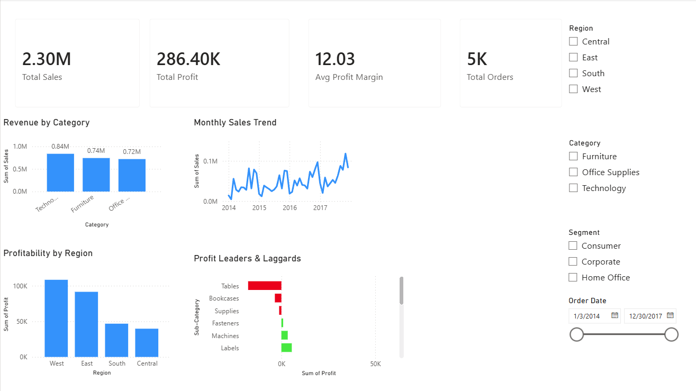

# Superstore Sales Analysis — End-to-End Dashboard Project

An end-to-end data analytics project that cleans, analyzes, and visualizes retail sales
data using **Python (Pandas)** for analysis and **Power BI** for interactive dashboarding.

---

## Project Overview

This project analyzes 3 years of sales data from a fictional retail superstore to uncover
insights around revenue drivers, regional profitability, seasonal trends, and
underperforming product lines. The goal was to simulate a real-world data analyst
workflow: from raw, messy data to a polished business-facing dashboard.

## Tools & Technologies

- **Python** (Pandas, Matplotlib, Seaborn) — data cleaning & exploratory analysis
- **Power BI** — interactive dashboard with slicers and drill-downs
- **Git/GitHub** — version control

## Dataset

[Superstore Sales Dataset](https://www.kaggle.com/datasets/vivek468/superstore-dataset-final) (Kaggle) —
9,994 rows of order-level retail transaction data across Products, Customers, and Regions (2014–2017).

## Business Questions Answered

1. Which product category drives the most revenue?
2. Which region is most profitable?
3. What is the monthly sales trend over time?
4. Which sub-categories are losing money?
5. Which customer segment is most valuable?

## Key Findings

- **Technology** leads in total revenue (~$836K), but the **West region**
  generates the highest profit overall. This shows that revenue and
  profitability do not always align.
- **November** is the strongest sales month by a wide margin, pointing to a
  clear holiday seasonality pattern worth planning inventory around.
- **Tables, Bookcases, and Supplies are all net-unprofitable**, despite solid
  sales volume, making them a high-value target for pricing or discount
  strategy review.
- The **Consumer segment** drives the most total profit, while **Corporate**
  customers have a slightly higher profit margin (13.0% vs. 11.6%).

## Repository Structure

sales-dashboard-project/
├── data/
│ └── Sample - Superstore.csv # Raw dataset
├── outputs/
│ ├── superstore_clean.csv # Cleaned dataset (Power BI source)
│ └── *.png # Exported charts from Python analysis
├── analysis.py # Data cleaning + EDA script
└── README.md

## How to Run This Project

1. Clone the repo: `git clone https://github.com/MarcHLev/sales-dashboard-project.git`
2. Install dependencies: `pip install pandas matplotlib seaborn`
3. Run the analysis: `python analysis.py`
4. Open `outputs/superstore_clean.csv` in Power BI to explore the dashboard

## Dashboard

The dashboard includes 4 KPI cards, category/regional/monthly sales breakdowns, a
profit-by-sub-category view with conditional color formatting, and interactive
slicers for Region, Category, Segment, and date range.

## Author

**[Marc Leveille]** — Information Systems student
[LinkedIn](https://www.linkedin.com/in/marc-leveille-5400b9380/) | [GitHub](https://github.com/MarcHLev)